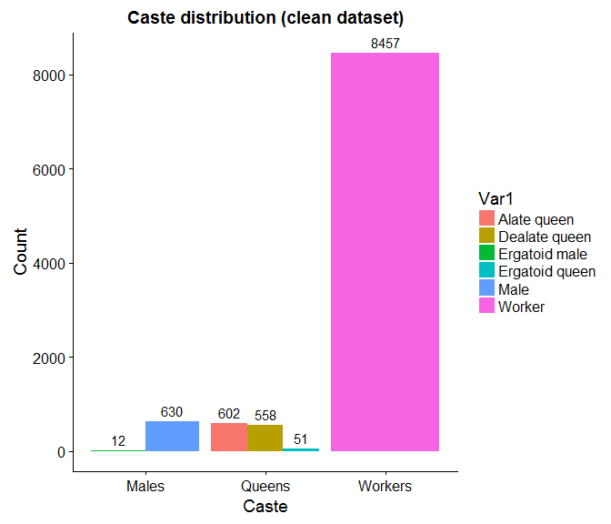
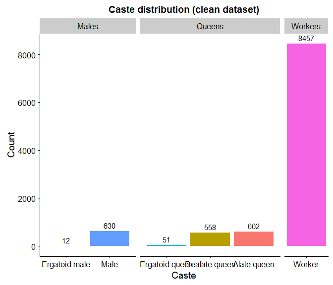

``` r
setwd("~/Internships/Internship CNN 2017-2018/FormicID/stat/caste")
plot_out_name <- "Uncleaned dataset.pdf"
library(ggplot2) # for plotting
library(gridExtra)
library(reshape2)
library(cowplot)
library(plyr)
library(magrittr)
```

``` r
data <- read.csv("caste_seperation.csv", sep=";")
data <- data[,c(4,5)]
freqtable <- table(data$caste)
castes <- c("Alate queen", "Dealate queen", "Ergatoid male", "Ergatoid queen", "Male",  "Worker")
castes_big <- c("Queens", "Queens", "Males", "Queens", "Males", "Workers")
df <- as.data.frame.table(freqtable)
df$Castes <- as.factor(castes_big)
levels(df$Var1) <- castes
df <- melt(df)
```

    ## Using Var1, Castes as id variables

``` r
df$label_ypos <- c(602, 1160, 12, 1211, 642, 8457)
df <- df[order(df$Castes),]
head(df)
```

    ##             Var1  Castes variable value label_ypos
    ## 3  Ergatoid male   Males     Freq    12         12
    ## 5           Male   Males     Freq   630        642
    ## 1    Alate queen  Queens     Freq   602        602
    ## 2  Dealate queen  Queens     Freq   558       1160
    ## 4 Ergatoid queen  Queens     Freq    51       1211
    ## 6         Worker Workers     Freq  8457       8457

``` r
p <-
    ggplot(df, aes(x = Castes,
                    y = value,
                    fill = Var1)) +
    geom_bar(stat = "identity", position = "dodge") +
    geom_text(aes(
        x = Castes,
        y = value,
        label = value,
        vjust = -0.5
    ),
    position = position_dodge(width = 0.9)) +
    ggtitle("Caste distribution (clean dataset)") +
    xlab("Caste") +
    ylab("Count")
p
```



``` r
df %>%
    ggplot(aes(x = reorder(Var1, value),  y = value, fill = Var1))  +
    geom_col(position = "dodge") +
    geom_text(aes(
        x = Var1,
        y = value,
        label = value,
        vjust = -0.5
    ),
    position = position_dodge(width = 0.9)) +
    ggtitle("Caste distribution (clean dataset)") +
    xlab("Caste") +
    ylab("Count") +
    theme(legend.position = "none")+
    facet_grid( ~ Castes, scales = "free_x", space = "free_x")
```


