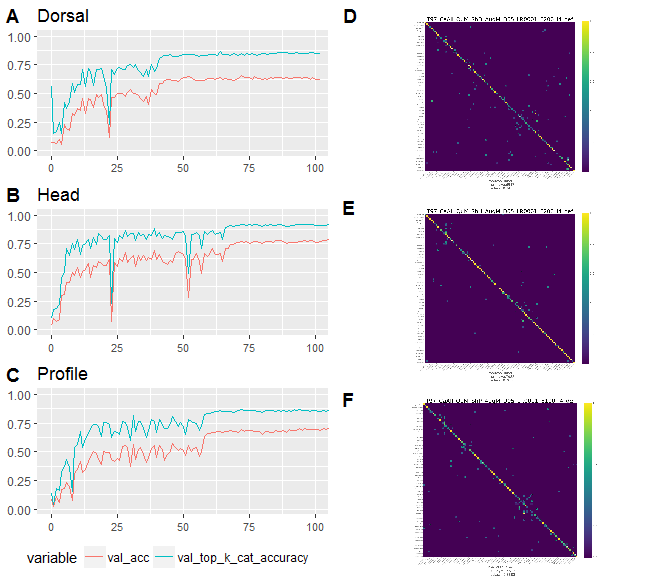

-   [Reading data](#reading-data)
-   [Reading CMs](#reading-cms)
-   [Plotting](#plotting)

``` r
setwd("~/Internships/Internship CNN 2017-2018/FormicID/stat/hdp")

library(ggplot2) # for plotting
library(gridExtra)
library(gtable)
library(grid)
library(reshape2)
library(magick)
library(ggpubr)
```

Reading data
------------

``` r
needed <- c("epoch", "val_acc", "val_top_k_cat_accuracy")
dorsal <-
    read.csv(
        "~/Internships/Internship CNN 2017-2018/FormicID/stat/hdp/HDP_experiments/T97_CaALL_QuM_ShD_AugM_D05_LR0001_E100_I4/summary/20180509_115750_metricslog.csv",
        header = TRUE,
        sep = ","
    )
dorsal <- dorsal[needed]
dorsal <- melt(dorsal, id = "epoch")
head <-
    read.csv(
        "~/Internships/Internship CNN 2017-2018/FormicID/stat/hdp/HDP_experiments/T97_CaALL_QuM_ShH_AugM_D05_LR0001_E100_I4_run2/summary/20180508_114708_metricslog.csv",
        header = TRUE,
        sep = ","
    )
head <- head[needed]
head <- melt(head, id = "epoch")
profile <-
    read.csv(
        "~/Internships/Internship CNN 2017-2018/FormicID/stat/hdp/HDP_experiments/T97_CaALL_QuM_ShP_AugM_D05_LR0001_E100_I4/summary/20180509_090722_metricslog.csv",
        header = TRUE,
        sep = ","
    )
profile <- profile[needed]
profile <- melt(profile, id = "epoch")
```

Reading CMs
-----------

``` r
dorsalcm <- image_read("~/Internships/Internship CNN 2017-2018/FormicID/stat/hdp/HDP_experiments/T97_CaAll_QuM_ShD_AugM_D05_LR0001_E100_I4/CM-T97_CaAll_QuM_ShD_AugM_D05_LR0001_E100_I4.png")
dorsalcm <- rasterGrob(dorsalcm)

headcm <- image_read("~/Internships/Internship CNN 2017-2018/FormicID/stat/hdp/HDP_experiments/T97_CaAll_QuM_ShH_AugM_D05_LR0001_E100_I4_run2/CM-T97_CaAll_QuM_ShH_AugM_D05_LR0001_E100_I4_run2.png")
headcm <- rasterGrob(headcm)

profilecm <- image_read("~/Internships/Internship CNN 2017-2018/FormicID/stat/hdp/HDP_experiments/T97_CaAll_QuM_ShP_AugM_D05_LR0001_E100_I4/CM-T97_CaAll_QuM_ShP_AugM_D05_LR0001_E100_I4.png")
profilecm <- rasterGrob(profilecm)
```

Plotting
--------

``` r
dd <-
    ggplot(data = dorsal, aes(x = epoch, y = value, colour = variable)) +
    geom_line() +
    coord_cartesian(xlim = c(0, 100), ylim = c(0, 1)) +
    theme(axis.text.x  = element_text(size = 8)) +
    ylab(NULL) +
    xlab(NULL) +
    ggtitle("Dorsal")
hh <-
    ggplot(data = head, aes(x = epoch, y = value, colour = variable)) +
    geom_line() +
    coord_cartesian(xlim = c(0, 100), ylim = c(0, 1)) +
    theme(axis.text.x  = element_text(size = 8)) +
    ylab(NULL) +
    xlab(NULL) +
    ggtitle("Head")
pp <-
    ggplot(data = profile, aes(x = epoch, y = value, colour = variable)) +
    geom_line() +
    coord_cartesian(xlim = c(0, 100), ylim = c(0, 1)) +
    theme(axis.text.x  = element_text(size = 8)) +
    ylab(NULL) +
    xlab(NULL) +
    ggtitle("Profile")
```

``` r
# legend = gtable_filter(ggplotGrob(dd), "guide-box")
# 
# grid.arrange(
#     arrangeGrob(
#         dd + theme(legend.position = "none"),
#         dorsalcm,
#         hh + theme(legend.position = "none"),
#         headcm,
#         pp + theme(legend.position = "none"),
#         profilecm,
#         nrow = 3,
#         top = textGrob(
#             "Validation accuracy",
#             vjust = 1,
#             gp = gpar(fontface = "bold", cex = 1.5)
#         ),
#         left = textGrob("Accuracy (%)", rot = 90, vjust = 1),
#         bottom = textGrob("Epochs", vjust = 1)
#     ),
#     legend,
#     widths = unit.c(unit(1, "npc") - legend$width, legend$width),
#     nrow = 1
# )
```

``` r
p1 <- ggarrange(
    dd,
    hh,
    pp,
    labels = c("A","B", "C"),
    common.legend = TRUE,
    legend = "bottom",
    align = "v",
    ncol = 1,
    nrow = 3
)

p2 <- ggarrange(
    dorsalcm,
    headcm,
    profilecm,
    labels = c("D", "E", "F"),
    align = "v",
    ncol = 1,
    nrow = 3
)
ggarrange(p1, p2, align="v", ncol = 2, nrow = 1)
```


