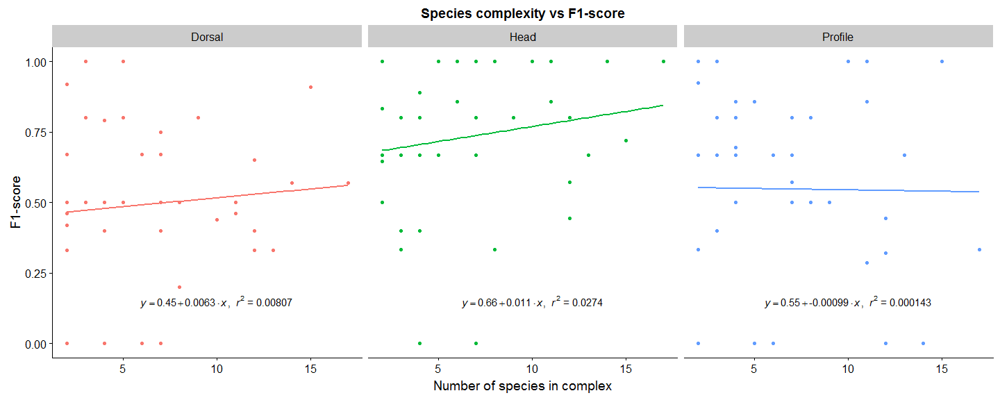

-   [Loading data](#loading-data)
-   [Function: getting equation](#function-getting-equation)
    -   [Equation](#equation)
-   [F1 Score](#f1-score)
-   [Plotting](#plotting)
    -   [Number of species in complex vs F1-score](#number-of-species-in-complex-vs-f1-score)
    -   [Support vs F1-Score](#support-vs-f1-score)
-   [PR + ROC curves](#pr-roc-curves)
    -   [Profile](#profile)

``` r
setwd("~/Internships/Internship CNN 2017-2018/FormicID/stat/hdp")


library(ggplot2) # for plotting
library(cowplot)
library(jpeg)
library(imager) # for reading jpg files
library(reshape2) # for using melt()
library(magick) # for image conversion because jpg files are read
library(plyr)
library(magrittr)
library(PRROC)
```

Loading data
============

``` r
sp_complex <-
    read.csv("speciescomplexexport.csv", sep=";")
sp_complexall <- 
    read.csv("speciescomplexexportall.csv", sep=";")
```

Function: getting equation
==========================

``` r
lm_eqn = function(df) {
    m = lm(y ~ x, df)
    eq <- substitute(
        italic(y) == a + b %.% italic(x) * ","
        ~~ italic(r) ^ 2 ~ "=" ~ r2,
        list(
            a = format(coef(m)[1], digits = 2),
            b = format(coef(m)[2], digits = 2),
            r2 = format(summary(m)$r.squared, digits = 3)
        )
    )
    as.character(as.expression(eq))
}
```

Equation
--------

``` r
eq <- ddply(sp_complex,.(Shottypes),lm_eqn)
eq2 <- ddply(sp_complexall,.(Shottypes),lm_eqn)
```

F1 Score
========

F1 Score is needed when you want to seek a balance between Precision and Recall. Right…so what is the difference between F1 Score and Accuracy then? We have previously seen that accuracy can be largely contributed by a large number of True Negatives which in most business circumstances, we do not focus on much whereas False Negative and False Positive usually has business costs (tangible & intangible) thus F1 Score might be a better measure to use if we need to seek a balance between Precision and Recall AND there is an uneven class distribution (large number of Actual Negatives).

Plotting
========

Number of species in complex vs F1-score
----------------------------------------

``` r
sp_complex_plot <-
    ggplot(sp_complex, aes(x = x,
                           y = y,
                           col = Shottypes)) +
    geom_point() +
    geom_smooth(method = "lm",
                se = FALSE,
                formula = y ~ x) +
    geom_text(
        data = eq,
        aes(x = 10, y = 0.15, label = V1),
        parse = T,
        inherit.aes = FALSE
    ) +
    facet_grid(~ Shottypes, scales = "free_x", space = "free_x") +
    ggtitle("Species complexity vs F1-score") +
    xlab("Number of species in complex") +
    ylab("F1-score") +
    theme(legend.position = "none")

sp_complex_plot
```



Support vs F1-Score
-------------------

``` r
sp_complexall_plot <-
    ggplot(sp_complexall, aes(x = x,
                           y = y,
                           col = Shottypes)) +
    geom_point() +
    geom_smooth(method = "lm",
                se = FALSE,
                formula = y ~ x) +
    geom_text(
        data = eq2,
        aes(x = 15, y = 0.5, label = V1),
        parse = T,
        inherit.aes = FALSE
    ) +
    xlim(c(0,25)) +
    facet_grid(~ Shottypes, scales = "free_x", space = "free_x") +
    ggtitle("Support vs F1-score") +
    xlab("Support") +
    ylab("F1-score") +
    theme(legend.position = "none")

sp_complexall_plot
```


PR + ROC curves
===============

I don't think these curves are correct \#\# Dorsal

``` r
par(mfrow=c(1,1))
dorsalpr <- 
    read.csv("T97_CaAll_QuM_ShD_AugM_D05_LR0001_E200_I4_def_clean_best_classification_report.csv", sep="," )
plot(dorsalpr$recall, dorsalpr$precision)
# abline(lm(dorsalpr$recall~dorsalpr$precision), col="red") # regression line (y~x) 
lines(lowess(dorsalpr$recall, dorsalpr$precision), col="blue") # lowess line (x,y)
```


``` r
pr <- pr.curve(dorsalpr$recall, dorsalpr$precision)
print(pr)
```

    ## 
    ##   Precision-recall curve
    ## 
    ##     Area under curve (Integral):
    ##      0.454848 
    ## 
    ##     Area under curve (Davis & Goadrich):
    ##      0.4548447 
    ## 
    ##     Curve not computed ( can be done by using curve=TRUE )

``` r
# compute area under ROC curve
roc <- roc.curve(dorsalpr$recall, dorsalpr$precision)
print( roc )
```

    ## 
    ##   ROC curve
    ## 
    ##     Area under curve:
    ##      0.4418992 
    ## 
    ##     Curve not computed ( can be done by using curve=TRUE )

``` r
# compute PR curve and area under curve
pr <- pr.curve(dorsalpr$recall, dorsalpr$precision, curve = TRUE )
# plot curve
plot(pr)
```


``` r
# compute ROC curve and area under curve
roc <- roc.curve(dorsalpr$recall, dorsalpr$precision, curve = TRUE)
# plot curve
plot(roc)
```

 \#\# Head

``` r
headpr <- 
    read.csv("T97_CaAll_QuM_ShH_AugM_D05_LR0001_E200_I4_def_clean_best_classification_report.csv", sep="," )
pr <- pr.curve(headpr$recall, headpr$precision)
print(pr)
```

    ## 
    ##   Precision-recall curve
    ## 
    ##     Area under curve (Integral):
    ##      0.4672511 
    ## 
    ##     Area under curve (Davis & Goadrich):
    ##      0.467251 
    ## 
    ##     Curve not computed ( can be done by using curve=TRUE )

``` r
roc <- roc.curve(headpr$recall, headpr$precision)
print( roc )
```

    ## 
    ##   ROC curve
    ## 
    ##     Area under curve:
    ##      0.4415348 
    ## 
    ##     Curve not computed ( can be done by using curve=TRUE )

``` r
pr <- pr.curve(headpr$recall, headpr$precision, curve = TRUE )
plot(pr)
```


``` r
roc <- roc.curve(headpr$recall, headpr$precision, curve = TRUE)
plot(roc)
```


Profile
-------

``` r
profilepr <- 
    read.csv("T97_CaAll_QuM_ShP_AugM_D05_LR0001_E200_I4_def_clean_best_classification_report.csv", sep="," )
pr <- pr.curve(profilepr$recall, profilepr$precision)
print(pr)
```

    ## 
    ##   Precision-recall curve
    ## 
    ##     Area under curve (Integral):
    ##      0.4872045 
    ## 
    ##     Area under curve (Davis & Goadrich):
    ##      0.487205 
    ## 
    ##     Curve not computed ( can be done by using curve=TRUE )

``` r
roc <- roc.curve(profilepr$recall, profilepr$precision)
print( roc )
```

    ## 
    ##   ROC curve
    ## 
    ##     Area under curve:
    ##      0.4691274 
    ## 
    ##     Curve not computed ( can be done by using curve=TRUE )

``` r
pr <- pr.curve(profilepr$recall, profilepr$precision, curve = TRUE )
plot(pr)
```


``` r
roc <- roc.curve(profilepr$recall, profilepr$precision, curve = TRUE)
plot(roc)
```


