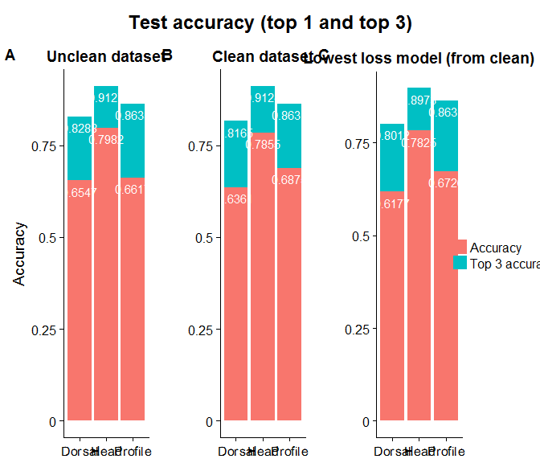

``` r
setwd("~/Internships/Internship CNN 2017-2018/FormicID/stat/hdp")
library(ggplot2)
library(cowplot)
library(reshape2)
library(gridExtra)
library(plyr)
```

``` r
data <- read.csv("testresults.csv", header = 1, sep = ";")
data$diff <- data$Test_top_3 - data$Test_top_1
data <- data[, c(1, 2, 4)]
names(data) <- c("Experiment", "Accuracy", "Top 3 accuracy")
data$Shottype<- rep(c("Dorsal","Dorsal","Dorsal","Head", "Head", "Head", "Profile","Profile", "Profile"), times=1)
# data <- melt(data[1:3])
# names(data) <- c("Experiment", "Category", "Percentage")
# data$Category <- relevel(data$Category, 'Test top 3')

unclean <- data[c(1,4,7), ]
unclean <- melt(unclean, value.name = "Percentage")
```

    ## Using Experiment, Shottype as id variables

``` r
# unclean$variable <- factor(unclean$variable, levels=rev(levels(unclean$variable)))
unclean <- ddply(unclean, "Shottype",
                   transform, label_ypos=cumsum(Percentage))
clean <- data[c(2, 5, 8), ]
clean <- melt(clean, value.name = "Percentage")
```

    ## Using Experiment, Shottype as id variables

``` r
clean <- ddply(clean, "Shottype",
                   transform, label_ypos=cumsum(Percentage))
best <- data[c(3, 6, 9), ]
best <- melt(best, value.name = "Percentage")
```

    ## Using Experiment, Shottype as id variables

``` r
best <- ddply(best, "Shottype",
                   transform, label_ypos=cumsum(Percentage))
```

``` r
brks <- c(.0, 0.25, 0.5, 0.75, 1.)
```

``` r
p1 <-
    ggplot(unclean, aes(x = Shottype, y = Percentage, fill = variable)) +
    geom_bar(stat = "identity", position = position_stack(reverse = TRUE)) +
    geom_text(aes(y = label_ypos, label = label_ypos),
    vjust = 1.6,
    color = "white") +
    scale_y_continuous(breaks = brks, labels = brks) +
    theme(axis.text.x = element_text(angle = 0.65, vjust = 0.6),
    legend.title = element_blank()) +
    ggtitle("Unclean dataset") +
    xlab(NULL) +
    ylab("Accuracy")
    legend_t <- get_legend(p1)
```

``` r
p2 <-
    ggplot(clean, aes(x = Shottype, y = Percentage, fill = variable)) +
    geom_bar(stat="identity", position = position_stack(reverse = TRUE)) +
    geom_text(aes(y = label_ypos, label = label_ypos),
              vjust = 1.6,
              color = "white") +
    scale_y_continuous(breaks = brks, labels = brks) +
    theme(axis.text.x = element_text(angle = 0.65, vjust = 0.6)) +
    ggtitle("Clean dataset") +
    xlab(NULL) +
    ylab(NULL)
```

``` r
p3 <-
    ggplot(best, aes(x = Shottype, y = Percentage, fill = variable)) +
    geom_bar(stat="identity", position = position_stack(reverse = TRUE)) +
    geom_text(aes(y = label_ypos, label = label_ypos),
              vjust = 1.6,
              color = "white") +
    scale_y_continuous(breaks = brks, labels = brks) +
    theme(axis.text.x = element_text(angle = 0.65, vjust = 0.6)) +
    ggtitle("Lowest loss model (from clean)") +
    xlab(NULL) +
    ylab(NULL)
```

``` r
plots <- plot_grid(
    p1 + theme(legend.position = "none"),
    p2 + theme(legend.position = "none"),
    p3 + theme(legend.position = "none"),
    ncol = 3,
    nrow = 1,
    align = "v",
    labels = c("AUTO")
)
prefinal <- plot_grid(plots, legend_t, rel_widths = c(3, .45))
title <- ggdraw() + draw_label("Test accuracy (top 1 and top 3)", size = 18, fontface = 'bold')
final <- plot_grid(title,
                   prefinal,
                   ncol = 1,
                   rel_heights = c(0.1, 1))
final
```



``` r
save_plot("testresults.pdf",
          final,
          base_width = 11,
          base_height = 3.5)
```
